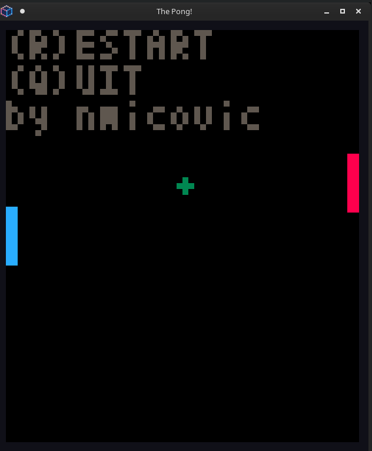
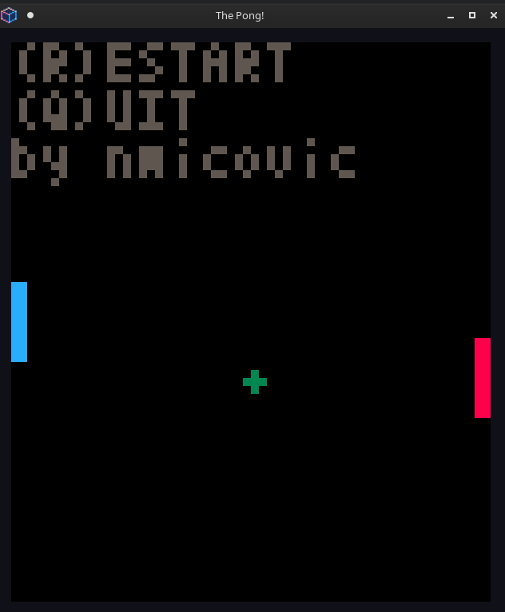

# The Pong in `Pyxel`
Implementation of the legendary [Pong](https://en.wikipedia.org/wiki/Pong)
game using the [Pyxel](https://github.com/kitao/pyxel) retro library for Python.

It was done as a fun few hours project just to have a loor around the Pyxel library.

### Implemented
- [x] Basic game logic
- [x] Dummy AI
- [x] Human player controller
- [x] Dummy physics
- [ ] Exciting and beautiful physics

Dummy AI vs dummy AI:



Human  vs dummy AI:



### How to run
- Install `poetry`
- Check if you have required libraries for `pyxel` installed (check docs)
- create a virtual env [optional]
- `$ poetry install`

```bash
$ python run_pong.py --help             
usage: run_pong.py [-h] [--left_ai] [--right_ai]

optional arguments:
  -h, --help  show this help message and exit
  --left_ai   enable AI on the left
  --right_ai  enable AI on the right
```

```bash
$ python run_pong.py --left_ai --right-ai
```

### Configuration
You can tweak most of the stuff in the game by editing the `config.py` file located in the `pong` directory.
Feel free to experiment.


